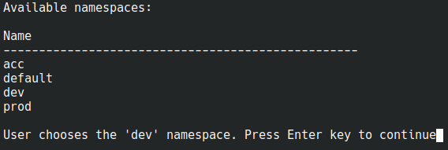
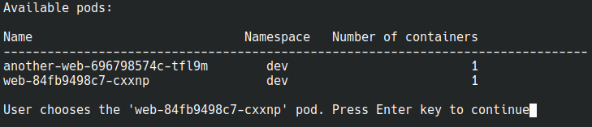
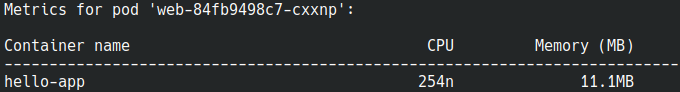

## Pod metrics CLI tool proof of concept

This is a proof of concept tool for showing pod metrics from a CLI tool. Developers and engineers need a tool that 
allows them to see pod metrics such as CPU utilization and memory usage across an entire cluster in a single pane 
view. Provided `kubectl pod` works for a single pod which requires context switching if viewing metrics for a 
different pod is needed.

#### Prerequisites

- A running K8s cluster (`minikube` works also)
- `metrics-server` installed. In case of `minikube` enable the addon with `minikube addons enable metrics-server`
- Three namespaces created; `dev`, `acc` and `prod`. In case of `minikube` use `minikube kubectl -- create namespace dev`
- Create one or more pods. A simple `hello-world` is fine; `minikube kubectl -- --namespace dev create deployment web --image=gcr.io/google-samples/hello-app:1.0`
- Python 3.6+

### Running the tool

- Create a virtual environment with `python -m venv venv`
- Install requirements with `pip install -r requirements.txt`
- Run `app.py` with `./app.py`

### Results

List namespaces:

List pods in a namespace:

Show metrics:

